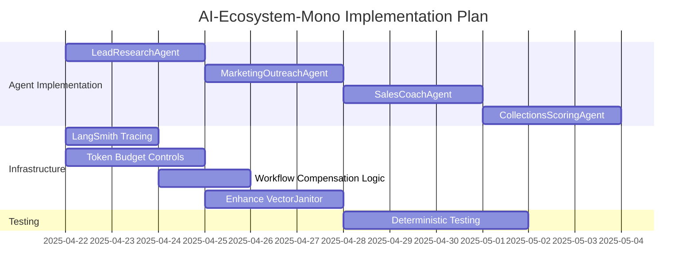

# 🗓️ AI-Ecosystem-Mono Development Roadmap

## 📅 Implementation Timeline

This roadmap outlines the planned implementation schedule for addressing the remaining critical gaps identified in the health check report. Each component has an estimated timeline, assigned owner, and specific acceptance criteria.

### Sprint 1 (Next Week)

| Component | Owner | Estimate | Acceptance Criteria |
|-----------|-------|----------|---------------------|
| **Complete LeadResearchAgent** | ML Engineer | 3 days | • Functional `plan()` and `act()` methods • Integration tests showing successful execution • Documentation of capabilities |
| **LangSmith Tracing** | DevOps | 2 days | • Traces visible in LangSmith console • Complete span context propagation • Cost tracking per workflow type |
| **Token Budget Controls** | ML Ops | 3 days | • Configurable token caps per agent/workflow • Usage tracking metrics • Graceful handling when limits reached |

### Sprint 2

| Component | Owner | Estimate | Acceptance Criteria |
|-----------|-------|----------|---------------------|
| **Complete MarketingOutreachAgent** | ML Engineer | 3 days | • Functional `plan()` and `act()` methods • Integration tests • Documentation |
| **Workflow Compensation Logic** | Backend | 2 days | • Clean state after workflow failures • Audit log of compensation activities • Integration tests demonstrating compensation |
| **Enhance VectorJanitor** | ML Ops | 3 days | • Systematic pruning of vector database • Duplicate and orphan detection • Scheduled execution |

### Sprint 3

| Component | Owner | Estimate | Acceptance Criteria |
|-----------|-------|----------|---------------------|
| **Complete SalesCoachAgent** | ML Engineer | 3 days | • Functional `plan()` and `act()` methods • Integration tests • Documentation |
| **Complete CollectionsScoringAgent** | ML Engineer | 3 days | • Functional `plan()` and `act()` methods • Integration tests • Documentation |
| **Deterministic Testing Enhancement** | QA | 4 days | • Reproducible test results for LLM interactions • Increased test coverage to 80%+ • Reduced test flakiness in CI |

## 🔍 Critical Path Dependencies

## 🚨 Risk Mitigation Plan

| Risk | Mitigation Strategy |
|------|---------------------|
| **Agent implementation delays** | Start with LeadResearchAgent as a template for others; modularize common functionality |
| **LangSmith integration issues** | Prepare fallback logging mechanism; engage LangChain support team early |
| **Cost control effectiveness** | Start with shadow mode that logs but doesn't block; A/B test with small percentage of traffic |
| **Test flakiness** | Implement deterministic fixtures; record/replay for LLM responses; add tolerance for semantic similarity |
| **Resource constraints** | Prioritize work based on business impact; consider bringing in contractor resources for lower-priority items |

## 🏁 Definition of Done

For each component to be considered complete, it must meet the following criteria:

1. ✅ **Functionality**: All specified features are implemented and working
2. ✅ **Testing**: Unit and integration tests with >80% coverage
3. ✅ **Documentation**: Code comments, docstrings, and updated architecture diagrams
4. ✅ **Security**: Passes security review and adheres to best practices
5. ✅ **Performance**: Meets performance benchmarks under expected load
6. ✅ **Observability**: Proper logging, tracing, and monitoring integration

## 📈 Success Metrics

The implementation of these components will be measured by the following success metrics:

| Metric | Current | Target | Timeline |
|--------|---------|--------|----------|
| Agent Task Success Rate | N/A | >90% | Sprint 3 |
| LLM Cost per Workflow | Unknown | <$0.50 | After Token Budget Controls |
| Mean Time to Debug (MTTD) | Hours | <30 mins | After LangSmith Tracing |
| Vector DB Size Growth | Unbounded | <5% weekly | After VectorJanitor Enhancement |
| Test Success Rate in CI | 92% | >99% | After Deterministic Testing |

## 🔄 Weekly Review Process

To ensure steady progress:

1. **Daily Standups**: 15-minute check-ins focused on blockers
2. **Weekly Demo**: Show working functionality to stakeholders
3. **Bi-weekly Retrospective**: Identify process improvements
4. **Architecture Review**: Before each new component is deployed to production
